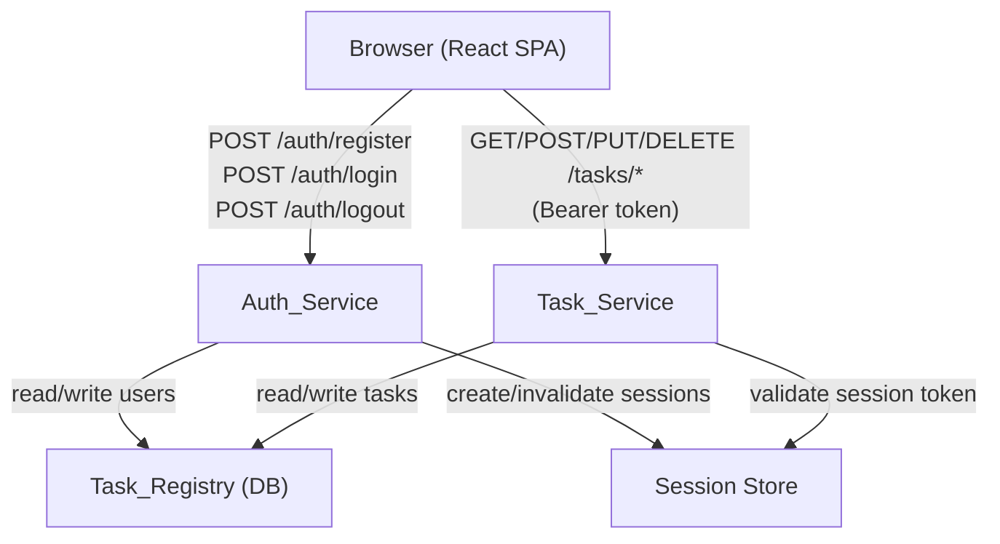

# Design Document: Task Manager App

## Overview

The task manager app is a full-stack application consisting of a Python RESTful API backend and a React frontend. Users register and log in to receive session tokens, then use those tokens to create, read, update, and delete their own tasks. Each user's tasks are private and isolated from other users.

The backend is structured as a RESTful API with three primary logical components:

- **Auth_Service** — handles registration, login, logout, and session management
- **Task_Service** — handles task CRUD operations, filtering, sorting, and status transitions
- **Task_Registry** — the persistence layer that stores users and tasks

The frontend is a single-page application (SPA) built with React and Vite that communicates with the backend API over HTTP.

The design prioritizes clear separation of concerns, predictable error responses, and secure credential handling.

---

## Architecture



**Key design decisions:**

- Session tokens are opaque random strings stored server-side (not JWTs), making invalidation straightforward.
- The Task_Service validates the session token on every request before performing any task operation.
- All error responses follow a uniform structure: `{ "error_code": "...", "message": "..." }`.

---

## Components and Interfaces

### Auth_Service

| Endpoint | Method | Description |
|---|---|---|
| `/auth/register` | POST | Register a new user |
| `/auth/login` | POST | Authenticate and receive a session token |
| `/auth/logout` | POST | Invalidate the current session token |

**Register** — accepts `{ email, password }`. Validates email uniqueness and password length (≥ 8 chars). Hashes the password before storage. Returns `201 Created` on success.

**Login** — accepts `{ email, password }`. Verifies credentials. Creates a session with a 24-hour inactivity expiry. Returns `{ session_token }`.

**Logout** — accepts `Authorization: Bearer <token>`. Invalidates the session immediately.

### Task_Service

| Endpoint | Method | Description |
|---|---|---|
| `/tasks` | POST | Create a new task |
| `/tasks` | GET | List tasks (with optional filters/sort) |
| `/tasks/:id` | GET | Get task details |
| `/tasks/:id` | PUT | Update task fields |
| `/tasks/:id/status` | PATCH | Update task status |
| `/tasks/:id` | DELETE | Delete a task |

All task endpoints require `Authorization: Bearer <token>`. The service resolves the user from the session token before any operation.

**List query parameters:**
- `status` — filter by `Pending | In Progress | Completed`
- `priority` — filter by `Low | Medium | High`
- `sort_by` — `due_date | created_at`
- `order` — `asc | desc`

### Task_Registry

The persistence layer. Exposes repository-style interfaces:

- `UserRepository` — `create`, `findByEmail`, `findById`
- `TaskRepository` — `create`, `findById`, `findAllByUser`, `update`, `delete`

---

## Data Models

### User

```
User {
  id:            UUID (primary key)
  email:         string (unique, not null)
  password_hash: string (not null)
  created_at:    timestamp
}
```

### Session

```
Session {
  token:          string (primary key, random opaque token)
  user_id:        UUID (foreign key → User.id)
  last_active_at: timestamp
  created_at:     timestamp
}
```

Sessions expire when `now - last_active_at > 24 hours`. The `last_active_at` is updated on each authenticated request.

### Task

```
Task {
  id:          UUID (primary key)
  user_id:     UUID (foreign key → User.id)
  title:       string (not null)
  description: string (nullable)
  status:      enum { Pending, In Progress, Completed }  default: Pending
  priority:    enum { Low, Medium, High }                nullable
  due_date:    date                                       nullable
  created_at:  timestamp
  updated_at:  timestamp
}
```

**Valid status transitions:**

```
Pending     → In Progress
Pending     → Completed
In Progress → Completed
In Progress → Pending
Completed   → Pending
```

`Completed → In Progress` is not permitted.

---

## Correctness Properties

*A property is a characteristic or behavior that should hold true across all valid executions of a system — essentially, a formal statement about what the system should do. Properties serve as the bridge between human-readable specifications and machine-verifiable correctness guarantees.*

### Property 1: Valid registration creates a user

*For any* valid email address and password of length ≥ 8, submitting a registration request should succeed and result in a new user account being created.

**Validates: Requirements 1.2**

---

### Property 2: Duplicate email is rejected

*For any* email address that has already been registered, a second registration attempt with that email should return an error indicating the email is already in use.

**Validates: Requirements 1.3**

---

### Property 3: Short password is rejected

*For any* password of length 0 to 7 characters, a registration attempt should return an error describing the password length requirement.

**Validates: Requirements 1.4**

---

### Property 4: Password is never stored as plaintext

*For any* password used during registration, the value stored in the database should not equal the plaintext password.

**Validates: Requirements 1.5**

---

### Property 5: Valid login returns a session token

*For any* registered user, submitting their correct credentials should return a non-empty session token.

**Validates: Requirements 2.1**

---

### Property 6: Login failure response is ambiguous

*For any* login attempt with a wrong email and *for any* login attempt with a wrong password, both should return the same generic error response that does not indicate which field is incorrect.

**Validates: Requirements 2.2**

---

### Property 7: Logout invalidates the session token

*For any* active session token, after logging out with that token, any subsequent authenticated request using that token should be rejected.

**Validates: Requirements 2.4**

---

### Property 8: Newly created tasks have Pending status

*For any* valid task creation request, the returned task should have its status set to Pending regardless of the title or optional fields provided.

**Validates: Requirements 3.1**

---

### Property 9: Optional task fields are accepted and stored correctly

*For any* combination of optional fields (description, due date, priority) provided at task creation, the created task should store exactly those values and return them in the response.

**Validates: Requirements 3.2**

---

### Property 10: Past due dates are rejected

*For any* date that is strictly before today, submitting it as a due date in either a task creation or task update request should return an error indicating the due date must be today or a future date.

**Validates: Requirements 3.4, 6.4**

---

### Property 11: Tasks are associated with their creating user

*For any* authenticated user who creates a task, the task's owner should be that user — and the task should appear in that user's task list and not in any other user's task list.

**Validates: Requirements 3.5**

---

### Property 12: Task list returns all and only the user's tasks

*For any* user with any set of tasks, requesting the task list should return exactly those tasks — no tasks belonging to other users, and no tasks omitted.

**Validates: Requirements 4.1**

---

### Property 13: Filter correctness

*For any* task list and any applied filter (by status or by priority), every task in the result should match the filter value, and no matching task should be absent from the result.

**Validates: Requirements 4.2, 4.3**

---

### Property 14: Sort ordering invariant

*For any* task list sorted by due date or creation date in ascending or descending order, every adjacent pair of tasks in the result should satisfy the specified ordering relation.

**Validates: Requirements 4.4, 4.5**

---

### Property 15: Task detail contains all fields

*For any* task, fetching it by its identifier should return all specified fields: title, description, status, priority, due date, creation date, and last updated date.

**Validates: Requirements 5.1**

---

### Property 16: Task isolation between users

*For any* two distinct users A and B, user B should not be able to read, update, or delete any task that belongs to user A — all such attempts should return a not-found error.

**Validates: Requirements 5.3, 6.5, 8.3**

---

### Property 17: Update round-trip

*For any* task and any valid update to its title, description, due date, or priority, the returned task should reflect exactly the updated values.

**Validates: Requirements 6.1, 6.2**

---

### Property 18: Update timestamp is monotonically non-decreasing

*For any* task, after any update (field update or status update), the `updated_at` timestamp on the returned task should be greater than or equal to the previous `updated_at` value.

**Validates: Requirements 6.6, 7.4**

---

### Property 19: Valid status transitions are accepted; invalid ones are rejected

*For any* task, each of the permitted transitions (Pending→In Progress, Pending→Completed, In Progress→Completed, In Progress→Pending, Completed→Pending) should succeed and return the task with the new status. Any transition not in this set should be rejected.

**Validates: Requirements 7.1, 7.2**

---

### Property 20: Deletion removes the task permanently

*For any* task owned by the requesting user, after a successful deletion, any subsequent attempt to fetch or update that task should return a not-found error.

**Validates: Requirements 8.1**

---

### Property 21: Error responses have a consistent structure

*For any* request that results in an error, the response body should contain both an `error_code` field and a `message` field with a human-readable description.

**Validates: Requirements 9.1, 9.2**

---

### Property 22: Unauthenticated requests to protected endpoints are rejected

*For any* protected endpoint, a request made without a valid session token should return an error indicating authentication is required.

**Validates: Requirements 9.3**

---

## Error Handling

All errors follow a uniform response envelope:

```json
{
  "error_code": "TASK_NOT_FOUND",
  "message": "The requested task does not exist."
}
```

**Error code catalogue:**

| Error Code | HTTP Status | Trigger |
|---|---|---|
| `EMAIL_ALREADY_IN_USE` | 409 | Registration with duplicate email |
| `PASSWORD_TOO_SHORT` | 422 | Password < 8 characters |
| `INVALID_CREDENTIALS` | 401 | Wrong email or password on login |
| `AUTHENTICATION_REQUIRED` | 401 | No token on protected endpoint |
| `SESSION_EXPIRED` | 401 | Token older than 24h inactivity |
| `TASK_NOT_FOUND` | 404 | Task doesn't exist or belongs to another user |
| `TITLE_REQUIRED` | 422 | Task created/updated with empty title |
| `DUE_DATE_IN_PAST` | 422 | Due date is before today |
| `INVALID_STATUS` | 422 | Unrecognized status value |
| `INVALID_STATUS_TRANSITION` | 422 | Disallowed status transition |
| `MALFORMED_REQUEST` | 400 | Unparseable or structurally invalid request body |

**Design decisions:**
- `TASK_NOT_FOUND` is returned for both "doesn't exist" and "belongs to another user" to avoid leaking ownership information.
- `INVALID_CREDENTIALS` does not distinguish between wrong email and wrong password to prevent user enumeration.
- All 4xx responses include the structured error envelope; 5xx responses also use the same envelope with a generic message.

---

## Testing Strategy

### Dual Testing Approach

Both unit/example-based tests and property-based tests are used:

- **Unit tests** cover specific examples, edge cases, and integration points (e.g., empty task list, non-existent task, expired session with mocked clock).
- **Property-based tests** verify universal correctness properties across randomly generated inputs.

### Property-Based Testing Library

Use **[fast-check](https://github.com/dubzzz/fast-check)** (TypeScript/JavaScript) or **[Hypothesis](https://hypothesis.readthedocs.io/)** (Python), depending on the implementation language. Each property test runs a minimum of **100 iterations**.

Each property test is tagged with a comment in the format:

```
// Feature: task-manager-app, Property N: <property_text>
```

### Property Test Coverage

Each of the 22 correctness properties maps to exactly one property-based test:

| Property | Test Description |
|---|---|
| P1 | Generate random valid emails + passwords ≥ 8 chars, verify registration succeeds |
| P2 | Generate random email, register twice, verify second returns EMAIL_ALREADY_IN_USE |
| P3 | Generate passwords of length 0–7, verify registration returns PASSWORD_TOO_SHORT |
| P4 | Generate random passwords, register, verify stored hash ≠ plaintext |
| P5 | Generate random users, register + login, verify non-empty token returned |
| P6 | Generate random credentials, attempt login with wrong email and wrong password, verify identical error |
| P7 | Generate random users, login → logout → use token, verify AUTHENTICATION_REQUIRED |
| P8 | Generate random task titles, create tasks, verify status = Pending |
| P9 | Generate random combinations of optional fields, create tasks, verify fields stored correctly |
| P10 | Generate random past dates, attempt create/update, verify DUE_DATE_IN_PAST error |
| P11 | Generate random users + tasks, verify task.user_id = creating user's id |
| P12 | Generate random users with random task sets, verify list returns exactly those tasks |
| P13 | Generate random task sets with mixed statuses/priorities, apply filters, verify all results match filter |
| P14 | Generate random task sets, sort by due_date and created_at, verify ordering invariant |
| P15 | Generate random tasks with all fields, fetch by id, verify all fields present |
| P16 | Generate two random users, create tasks for user A, attempt read/update/delete as user B, verify TASK_NOT_FOUND |
| P17 | Generate random tasks + valid updates, apply update, verify returned task reflects changes |
| P18 | Generate random tasks, apply updates, verify updated_at ≥ previous updated_at |
| P19 | For each valid transition, verify success; for each invalid transition, verify rejection |
| P20 | Generate random tasks, delete, verify subsequent fetch returns TASK_NOT_FOUND |
| P21 | Generate error-triggering inputs for all endpoints, verify response has error_code + message |
| P22 | For each protected endpoint, make unauthenticated request, verify AUTHENTICATION_REQUIRED |

### Unit Test Coverage

Unit tests focus on:
- Empty task list returns `[]` (Requirement 4.6)
- Expired session with mocked clock (Requirement 2.5)
- Session-expired error response (Requirement 9.4)
- Malformed JSON body returns MALFORMED_REQUEST
- Invalid status string returns INVALID_STATUS with valid values listed
- Empty title on create/update returns TITLE_REQUIRED

---

## Frontend Architecture

### Tech Stack

- **React** (via **Vite**) — component-based UI framework with fast HMR dev server
- **React Router v6** — client-side routing and navigation
- **fetch / axios** — HTTP client for API calls; all requests include the `Authorization: Bearer <token>` header when a session token is present in `localStorage`
- **CSS Modules or Tailwind CSS** — scoped styling with responsive utilities

### Project Structure

```
frontend/
  src/
    api/          # API client functions (auth.js, tasks.js)
    components/   # Reusable UI components
    context/      # React Context providers (AuthContext)
    pages/        # Page-level components mapped to routes
    App.jsx       # Router setup and ProtectedRoute wrapper
    main.jsx      # Vite entry point
```

### Pages and Routes

| Route | Page Component | Auth Required |
|---|---|---|
| `/login` | `LoginPage` | No |
| `/register` | `RegisterPage` | No |
| `/tasks` | `TaskListPage` | Yes |
| `/tasks/new` | `TaskFormPage` (create mode) | Yes |
| `/tasks/:id` | `TaskDetailPage` | Yes |

Unauthenticated users who navigate to a protected route are redirected to `/login` by a `ProtectedRoute` wrapper component.

### Component Breakdown

| Component | Responsibility |
|---|---|
| `AuthForm` | Shared form shell for login and registration; renders email/password fields and an error summary |
| `TaskList` | Renders a list of `TaskCard` components; includes filter and sort controls |
| `TaskCard` | Displays a single task's title, status badge, priority, and due date in a compact card |
| `TaskForm` | Controlled form for creating and editing tasks; handles all fields and inline validation |
| `StatusBadge` | Renders a colour-coded badge for a task's current status |
| `ErrorMessage` | Inline error display component rendered adjacent to a form field |

### State Management

- **`AuthContext`** — a React Context provider that wraps the entire app. Stores the session token and the current user. Exposes `login(token)`, `logout()`, and `isAuthenticated` helpers.
- **Page-level `useState`** — each page manages its own data (task list, form fields, loading/error state) with `useState` and `useEffect`.
- No external state management library (Redux, Zustand) is required for this scope.

### Session Token Flow

```
1. User submits login form
2. LoginPage calls POST /auth/login via api/auth.js
3. On success, AuthContext.login(token) is called
4. login() writes the token to localStorage and updates context state
5. All subsequent API calls in api/tasks.js read the token from context
   and attach it as Authorization: Bearer <token>
6. On logout, AuthContext.logout() removes the token from localStorage,
   clears context state, and navigates to /login
7. On app load, AuthContext initialises by reading localStorage —
   if a token is present the user is treated as authenticated
```

### Frontend Correctness Properties

#### Property 23: Unauthenticated users are redirected to login

*For any* protected route (`/tasks`, `/tasks/new`, `/tasks/:id`), if no session token is present in `localStorage`, the frontend SHALL redirect the user to `/login` without rendering the protected page.

**Validates: Requirements 11.2**

---

#### Property 24: Session token is attached to every protected API call

*For any* API call to a protected backend endpoint made while a session token is stored in `localStorage`, the request SHALL include an `Authorization: Bearer <token>` header containing that token.

**Validates: Requirements 11.4**

---

#### Property 25: Form errors are shown before submission reaches the API

*For any* form submission that violates a frontend validation rule (empty title, past due date, short password, empty required field), the frontend SHALL display an inline error message and SHALL NOT send the request to the API.

**Validates: Requirements 12.1, 12.2, 12.3, 12.4, 12.5**

---

#### Property 26: Logout clears the session and redirects

*For any* authenticated session, after the user triggers logout, the session token SHALL be removed from `localStorage`, the `AuthContext` state SHALL be cleared, and the user SHALL be redirected to `/login`.

**Validates: Requirements 11.3**
